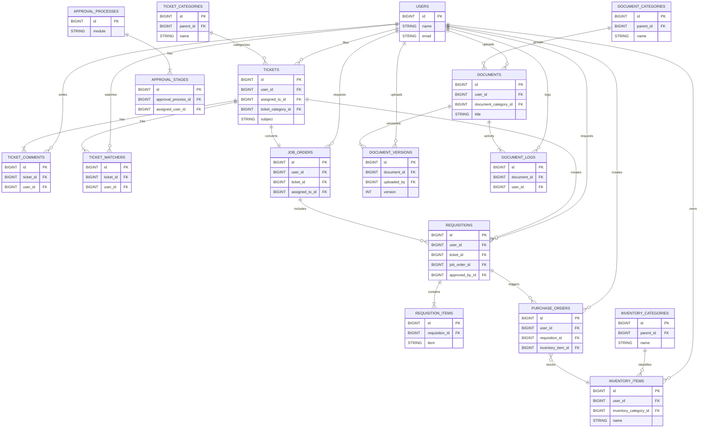

# 🗄️ Database ER Diagram

This diagram summarizes the main tables and relationships in the LCCD Integrated Information System. For clarity it focuses on the core modules used across Tickets, Job Orders, Requisitions, Inventory, Purchase Orders, and Document Management.

*Note: Not all columns are shown. This simplified ERD highlights the primary keys and foreign key relationships used across the major modules.*
