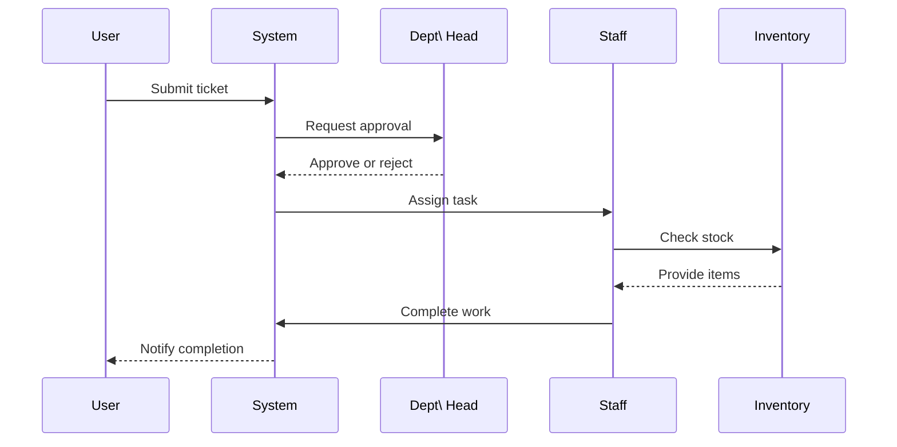

# 🔄 Ticket Workflow Sequence

This UML sequence diagram illustrates how a ticket flows from creation to resolution. It highlights approvals and inventory checks typical across modules.

*Note: Finance or President approvals may occur depending on the requisition amount.*
